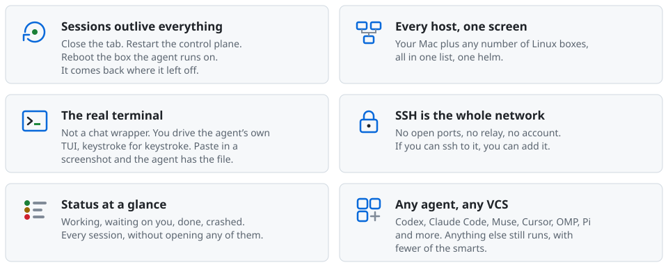
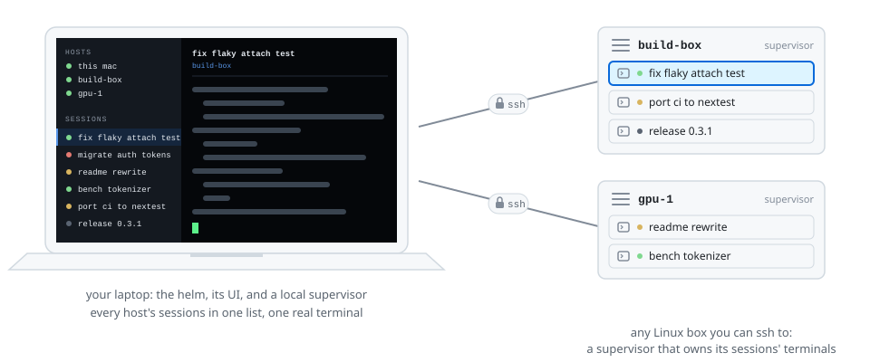
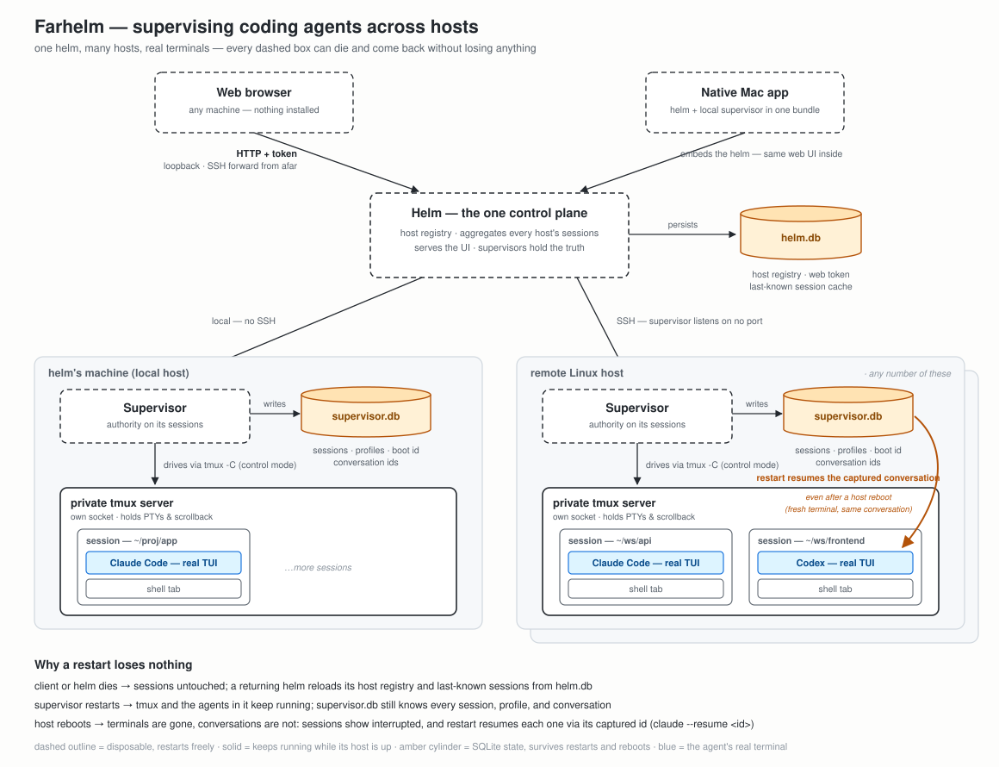

> [!WARNING]
> **This repository is public, but you probably should not use it.** I use farhelm as my daily driver, and it is public
> so that I can work on it in the open, not because it is ready for anyone else. It is not recommended for general use
> at this time, for a variety of reasons. Do not expect user-friendliness, do not expect the documentation to be correct
> or helpful, and do not expect anything else either. This notice goes away when that changes.

<!-- The header, the pillars, and the how-it-works drawing are SVG files rendered by docs/readme/render-svgs.mjs; edit that
     script and re-run it rather than the SVGs. GitHub shows an SVG only through , which cannot see
     the page's colour scheme, so each block is two files picked by a <picture> media query. -->

<p align="center">
  <picture>
    <source media="(prefers-color-scheme: dark)" srcset="docs/readme/header-dark.svg">
    
  </picture>
</p>

<p align="center">
  <a href="https://github.com/scode/farhelm/releases/latest"></a>
  
  <a href="LICENSE"></a>
</p>

<p align="center">
  One screen for every coding agent you run, on every machine you own. Real terminals over your own SSH, still
  running on the remote box when you close the lid.
</p>

<!-- The image below is a real capture of the web UI against a staged fleet, regenerated by
     scripts/readme-screenshot.sh and published by scripts/publish-readme-hero.sh, which rewrites
     the URL inside the markers below. See docs/readme-hero/SPEC.md. Do not edit the URL by hand.
     The markers wrap the whole image line rather than sitting inside its parens: a comment placed
     inside a link destination becomes part of the URL instead of being hidden, which is what broke
     this image the first time around. -->
<!-- readme-hero-url -->


<!-- /readme-hero-url -->

<p align="center"><sub>Seven sessions across three hosts. The status dot on each row is the supervisor's own read of
the live terminal.</sub></p>

<p align="center">
  <picture>
    <source media="(prefers-color-scheme: dark)" srcset="docs/readme/pillars-dark.svg">
    
  </picture>
</p>

## How it works

<p align="center">
  <picture>
    <source media="(prefers-color-scheme: dark)" srcset="docs/readme/how-it-works-dark.svg">
    
  </picture>
</p>

One **helm** is the control plane: it holds the host list, serves the UI, and connects straight to a **supervisor** on
each host over SSH. The supervisor owns the agents' real terminals and their state. Nothing listens on a network port,
nothing goes through a relay, and every box in the diagram can restart without losing a session.

<details>
<summary>More details (architecture diagram)</summary>



</details>

## Install

```
curl -fsSL https://raw.githubusercontent.com/scode/farhelm/main/scripts/install.sh | sh
```

See [installation and uninstall](docs/install_uninstall.md) for more detail about what installation does and how to
uninstall.

Installs `farhelm` into `~/.local/bin`. On macOS it also installs `farhelm-desktop` and a macOS app bundle
(`~/Applications/Farhelm.app`). Does NOT auto-upgrade (yet) — re-run the same command to update.

To uninstall, stop local sessions and their additional terminals, quit the desktop app, and stop manually started
Farhelm processes. Run `farhelm uninstall` and confirm once, or use `farhelm uninstall --dry-run` to preview removal.
The command removes this installation's files and its setup-owned Linux services, preserving all user data and custom
service configuration. Releases without the command need one installer update first. Keep installation, updates, setup
and Farhelm startup stopped until uninstall finishes.

## More info

See [fresh GitHub checkouts](docs/github-checkouts.md) to configure `gh:owner/repo` launches and checkout retention
after deletion.

Setup and development instructions are still parked at [docs/old_readme.md](docs/old_readme.md) while this README is
being rebuilt.
