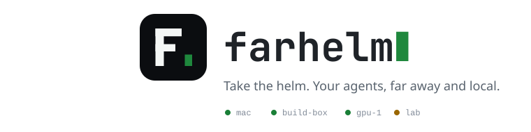
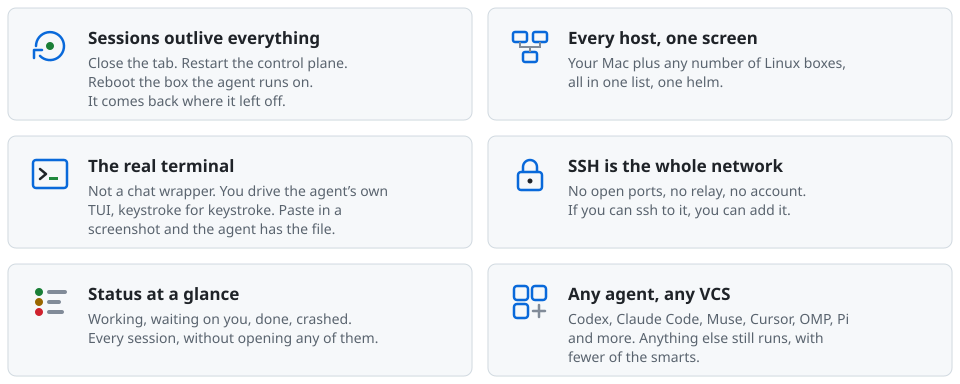
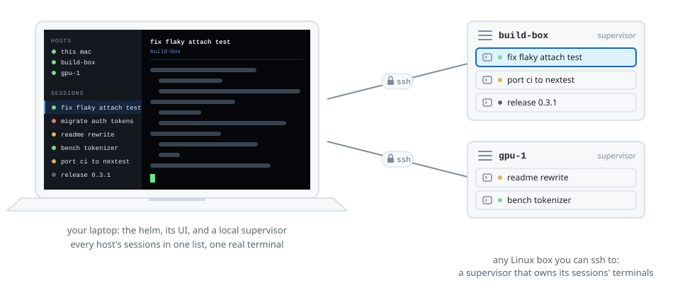
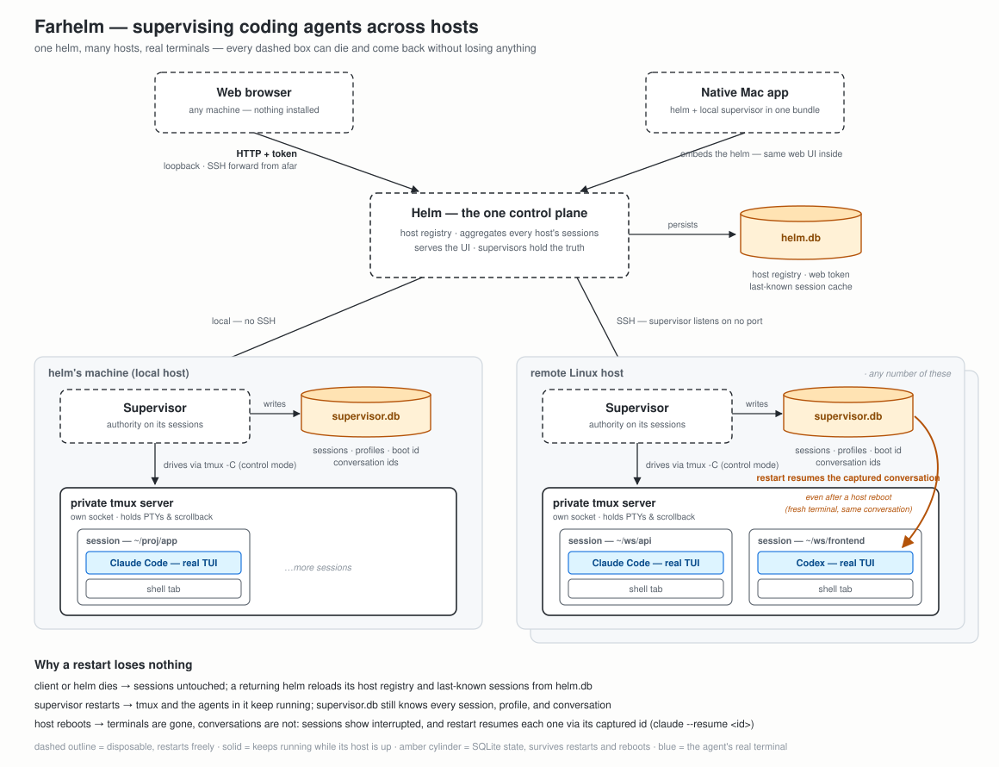

<!-- The header, the pillars, and the how-it-works drawing are SVG files rendered by website/scripts/render-svgs.mjs; edit
     that script and re-run it rather than the SVGs. They belong to the docs website, whose landing page shows the same
     introduction, and this file borrows them from there. GitHub shows an SVG only through , which cannot see
     the page's colour scheme, so each block is two files picked by a <picture> media query. -->

  <picture>
    <source media="(prefers-color-scheme: dark)" srcset="website/src/assets/intro/header-dark.svg">
    
  </picture>

  
  
  

  One screen for every coding agent you run, on every machine you own. Real terminals over your own SSH, still
  running on the remote box when you close the lid.

<!-- The image below is a real capture of the web UI against a staged fleet, regenerated by
     scripts/readme-screenshot.sh and published by scripts/publish-readme-hero.sh, which rewrites
     the URL inside the markers below, and the same URL on the docs website's landing page.
     See docs/readme-hero/SPEC.md. Do not edit the URL by hand.
     The markers wrap the whole image line rather than sitting inside its parens: a comment placed
     inside a link destination becomes part of the URL instead of being hidden, which is what broke
     this image the first time around. -->
<!-- readme-hero-url -->

<!-- /readme-hero-url -->

  Seven sessions across three hosts. The status dot on each row is the supervisor's own read of
    the live terminal.

  <picture>
    <source media="(prefers-color-scheme: dark)" srcset="website/src/assets/intro/pillars-dark.svg">
    
  </picture>

## How it works

  <picture>
    <source media="(prefers-color-scheme: dark)" srcset="website/src/assets/intro/how-it-works-dark.svg">
    
  </picture>

One **helm** is the control plane: it holds the host list, serves the UI, and connects straight to a **supervisor** on
each host over SSH. The supervisor owns the agents' real terminals and their state. Nothing listens on a network port,
nothing goes through a relay, and every box in the diagram can restart without losing a session.

More details (architecture diagram)

## Docs and installation

See [farhelm.io](https://farhelm.io) for documentation and installation instructions.
